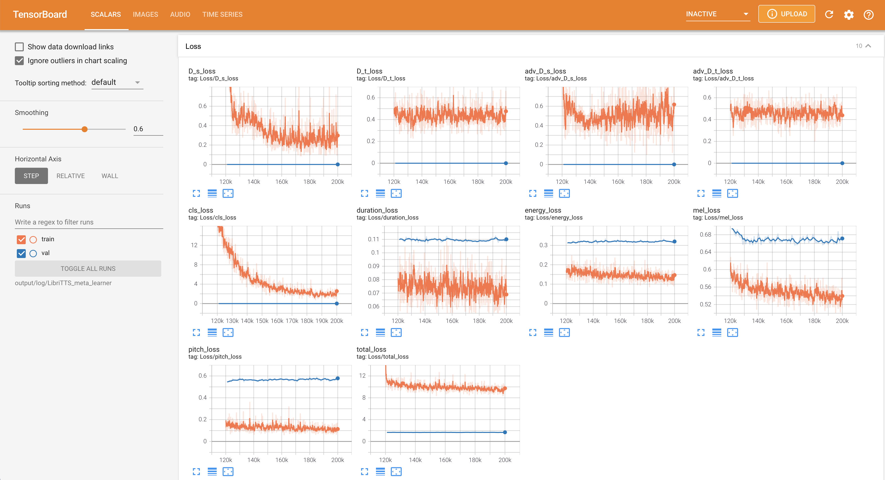
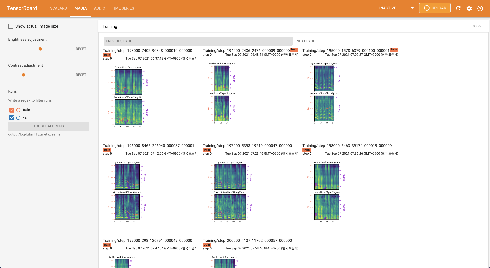
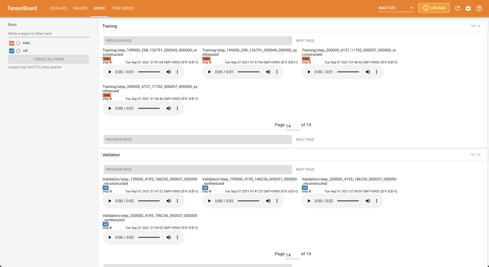

# StyleSpeech - PyTorch Implementation

PyTorch Implementation of [Meta-StyleSpeech : Multi-Speaker Adaptive Text-to-Speech Generation](https://arxiv.org/abs/2106.03153). 

<p align="center">
    
</p>

<p align="center">
    
</p>

# Branch
- [x] StyleSpeech (`naive` branch)
- [x] Meta-StyleSpeech (`main` branch)

# Quickstart

## Dependencies
You can install the Python dependencies with
```
pip3 install -r requirements.txt
```

## Inference

You have to download [pretrained models](https://drive.google.com/drive/folders/1fQmu1v7fRgfM-TwxAJ96UUgnl79f1FHt?usp=sharing) and put them in ``output/ckpt/LibriTTS_meta_learner/``.

For English multi-speaker TTS, run
```
python3 synthesize.py --text "YOUR_DESIRED_TEXT" --ref_audio path/to/reference_audio.wav --restore_step 200000 --mode single -p config/LibriTTS/preprocess.yaml -m config/LibriTTS/model.yaml -t config/LibriTTS/train.yaml
```
The generated utterances will be put in ``output/result/``. Your synthesized speech will have `ref_audio`'s style.


## Batch Inference
Batch inference is also supported, try

```
python3 synthesize.py --source preprocessed_data/LibriTTS/val.txt --restore_step 200000 --mode batch -p config/LibriTTS/preprocess.yaml -m config/LibriTTS/model.yaml -t config/LibriTTS/train.yaml
```
to synthesize all utterances in ``preprocessed_data/LibriTTS/val.txt``. This can be viewed as a reconstruction of validation datasets referring to themselves for the reference style.

## Controllability
The pitch/volume/speaking rate of the synthesized utterances can be controlled by specifying the desired pitch/energy/duration ratios.
For example, one can increase the speaking rate by 20 % and decrease the volume by 20 % by

```
python3 synthesize.py --text "YOUR_DESIRED_TEXT" --restore_step 200000 --mode single -p config/LibriTTS/preprocess.yaml -m config/LibriTTS/model.yaml -t config/LibriTTS/train.yaml --duration_control 0.8 --energy_control 0.8
```
Note that the controllability is originated from FastSpeech2 and not a vital interest of StyleSpeech. Please refer to [STYLER](https://arxiv.org/abs/2103.09474) [[demo](https://keonlee9420.github.io/STYLER-Demo/), [code](https://github.com/keonlee9420/STYLER)] for the controllability of each style factor.

# Training

## Datasets

The supported datasets are

- [LibriTTS](https://research.google/tools/datasets/libri-tts/): a multi-speaker English dataset containing 585 hours of speech by 2456 speakers.
- (will be added more)

## Preprocessing
 
Run 
```
python3 prepare_align.py config/LibriTTS/preprocess.yaml
```
for some preparations.

For the forced alignment, [Montreal Forced Aligner](https://montreal-forced-aligner.readthedocs.io/en/latest/) (MFA) is used to obtain the alignments between the utterances and the phoneme sequences.
Pre-extracted alignments for the datasets are provided [here](https://drive.google.com/drive/folders/1fizpyOiQ1lG2UDaMlXnT3Ll4_j6Xwg7K?usp=sharing). 
You have to unzip the files in `preprocessed_data/LibriTTS/TextGrid/`. Alternately, you can [run the aligner by yourself](https://montreal-forced-aligner.readthedocs.io/en/latest/user_guide/workflows/index.html).

After that, run the preprocessing script by
```
python3 preprocess.py config/LibriTTS/preprocess.yaml
```

## Training

Train your model with
```
python3 train.py -p config/LibriTTS/preprocess.yaml -m config/LibriTTS/model.yaml -t config/LibriTTS/train.yaml
```
As described in the paper, the script will start from pre-training the naive model until `meta_learning_warmup` steps and then meta-train the model for additional steps via episodic training.

# TensorBoard

Use
```
tensorboard --logdir output/log/LibriTTS
```

to serve TensorBoard on your localhost.
The loss curves, synthesized mel-spectrograms, and audios are shown.





# Implementation Issues

1. Use `22050Hz` sampling rate instead of `16kHz`.
2. Add one fully connected layer at the beginning of Mel-Style Encoder to upsample input mel-spectrogram from `80` to `128`.
3. The model size including meta-learner is `28.197M`.
4. Use a maximum `16` batch size on training instead of `48` or `20` mainly due to the lack of memory capacity with a single **24GiB TITAN-RTX**. This can be achieved by the following script to filter out data longer than `max_seq_len`:
    ```
    python3 filelist_filtering.py -p config/LibriTTS/preprocess.yaml -m config/LibriTTS/model.yaml
    ```
    This will generate `train_filtered.txt` in the same location of `train.txt`.
5. Since the total batch size is decreased, the number of training steps is doubled compared to the original paper.
6. Use **HiFi-GAN** instead of **MelGAN** for vocoding.

# Citation

```
@misc{lee2021stylespeech,
  author = {Lee, Keon},
  title = {StyleSpeech},
  year = {2021},
  publisher = {GitHub},
  journal = {GitHub repository},
  howpublished = {\url{https://github.com/keonlee9420/StyleSpeech}}
}
```

# References
- [Meta-StyleSpeech : Multi-Speaker Adaptive Text-to-Speech Generation](https://arxiv.org/abs/2106.03153)
- [A Style-Based Generator Architecture for Generative Adversarial Networks](https://arxiv.org/abs/1812.04948)
- [Matching Networks for One Shot Learning](https://arxiv.org/abs/1606.04080)
- [Prototypical Networks for Few-shot Learning](https://arxiv.org/pdf/1703.05175v2.pdf)
- [TADAM: Task dependent adaptive metric for improved few-shot learning](https://arxiv.org/abs/1805.10123)
- [ming024's FastSpeech2](https://github.com/ming024/FastSpeech2)


# NOTES:
- 300000 time musk
- 300000 freq luhman
- Random masking for mel-spectrogram (time and or frequency domain) during fine-tuning e2e of the entire architecture.
- FastSpeech 기반

- emg train and val filelist은 train.py and evaluate.py에서 바꿔야함
- 추가적으로 utils 안에 있는 model과 tools.py를 수정해야 함. loss 부분도 maybe
- filelist version2에서 sp} 를 }로 바꿈.